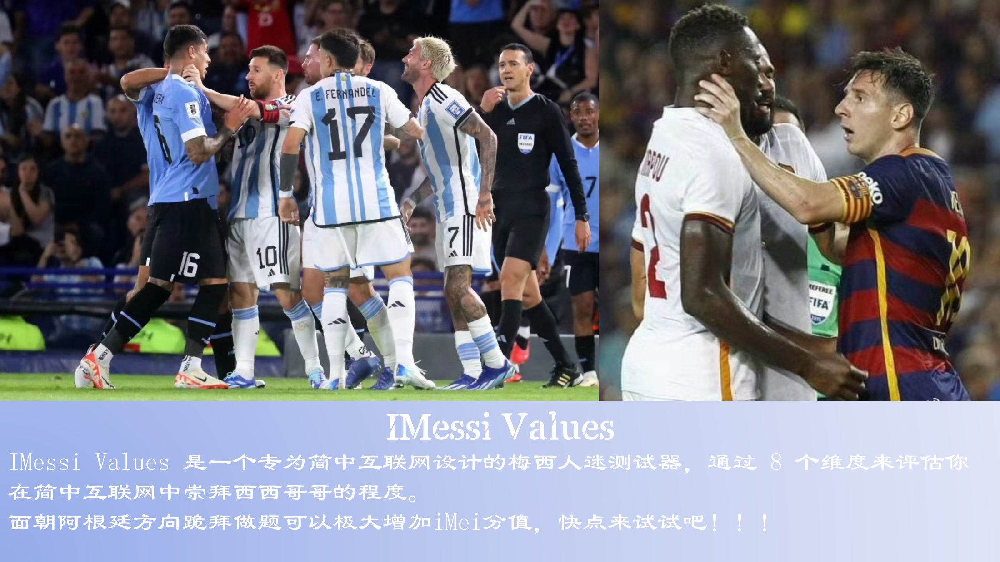

# IHua Values

IHua Values 是一个专为人类设计的华总虔诚信徒测试器，通过：

- [x] 政治华学
- [x] 修仙华学
- [x] 地上华学
- [x] 商务华学
- [x] 理论华学
- [x] 计算华学
- [x] 历史华学
- [x] 相对华学

这8个维度来评估你在华门中的修为。如果你没有第一时间意识到华总牛逼的伟大，那么你注定是一个碌碌无为的普通人。做题时高喊华总牛逼可以极大增加iHua分值，快点来试试吧！！！

测试网址: [化学测试](https://huazongniubi.github.io/)

项目由 Claude、DeepSeek、Gemini 、 GPT 和 No.1 iHua 协作完成。

特别致谢，Mark Pro 帮我调低佣金